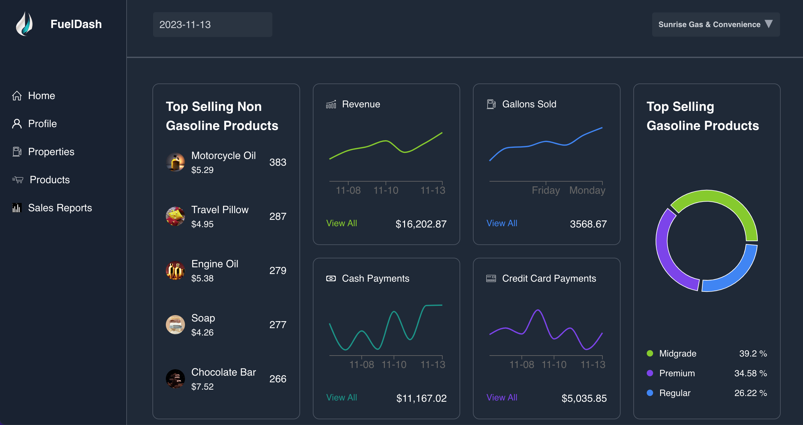

# FuelDash

## Introduction
FuelDash is an innovative platform designed specifically for independent gas station owners. It provides a comprehensive dashboard that transforms complex data into actionable insights, enabling business owners to make informed decisions that enhance profitability and stimulate growth. With its user-friendly interface, FuelDash empowers small businesses by offering tools for revenue tracking, gallons sold, product management, and financial metrics analysis.

## Live Demo Account
To truly experience the full potential of FuelDash and explore its rich features firsthand, we have set up a demo account pre-loaded with comprehensive data. This account gives you immediate access to an extensive range of analytics, inventory management examples, sales reports, and much more, demonstrating the powerful insights and optimizations FuelDash offers to gas station owners.

### Demo Account Details:
- **Username**: bobby@email.com
- **Password**: password1

## Contact

**Aman Singh**

- Email: [amsingh714@gmail.com](mailto:amsingh714@gmail.com)
- Portfolio: [amans.dev](https://amans.dev)
- Project Link: [FuelDash](https://www.fueldash.co/)

## About This Project
FuelDash was created to address the specific needs of mom-and-pop gas stations. It recognizes the challenges these businesses face in tracking and managing data. By leveraging the latest technology, FuelDash aims to streamline operations, maximize profits, and provide insights that were previously accessible only to larger chains.

## Features
- **Intuitive Dashboard**: A central hub for monitoring key performance indicators, including revenue, gallons sold, and product sales.
- **Real-time Analytics**: Gain immediate insights into your business operations to make timely decisions.
- **Inventory Management**: Automated tools to manage stock levels efficiently, reducing the risk of runouts and overstocking.
- **Sales Reports**: Detailed analyses that highlight trends, profitability, and areas for improvement.
- **Customer Insights**: Understand your customer's behavior and preferences to tailor your offerings and improve satisfaction.

## Technologies
FuelDash is built using cutting-edge technology to ensure reliability and ease of use:

### Backend
- **Express.js**: A web application framework for Node.js, designed for building web applications and APIs.
- **Mongoose**: An Object Data Modeling (ODM) library for MongoDB and Node.js, managing relationships between data, provides schema validation, and is used to translate between objects in code and the representation of those objects in MongoDB.
- **bcryptjs**: A library to help hash passwords.
- **cookie-parser**: Middleware to parse and set cookies in HTTP requests.
- **helmet**: Helps secure your apps by setting various HTTP headers.
- **jsonwebtoken**: An implementation of JSON Web Tokens for token-based authentication.
- **morgan**: HTTP request logger middleware for node.js.

### Frontend
- **React**: A JavaScript library for building user interfaces, facilitating the development of single-page applications with interactive UIs.
- **@tanstack/react-query and @tanstack/react-table**: Libraries for fetching, caching, and updating asynchronous data in React applications, enhancing state management and data manipulation capabilities.
- **axios**: A Promise-based HTTP client for the browser and node.js, used for making HTTP requests.
numeral: A library for formatting and manipulating numbers.
- **react-router-dom**: The standard routing library for React, used for navigation within a single-page application without page reloads.
- **recharts**: A composable charting library built on React components.
- **sass**: A preprocessor scripting language that is interpreted or compiled into Cascading Style Sheets (CSS).

## Usage

- **Dashboard**: Access real-time data and analytics to monitor business performance.
- **Inventory Management**: Keep track of stock levels, receive alerts for low inventory, and automate reordering.
- **Sales Analysis**: Utilize detailed reports to understand sales trends, identify best-selling products, and optimize pricing strategies.
